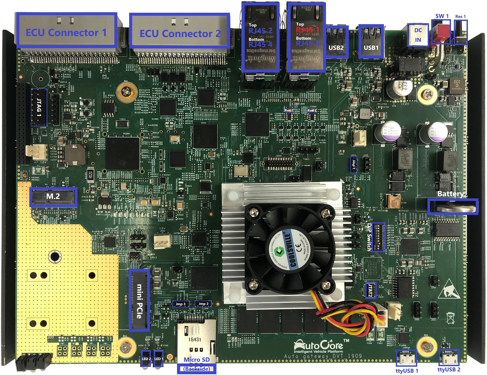

# PCU Hardware Manual

> The *PCU Hardware Manual* provides the detailed information of the PCU dev board, e.g. interfaces, cables, hardware settings, etc.

## Table of Contents
1. [PCU Block Diagram](#pcu-block-diagram)
2. [PCU Schematic](#pcu-schematic)
3. [Interfaces](#interfaces)
   - [PCU Interfaces Front View](#pcu-interfaces-front-view)
   - [PCU Interfaces Top View](#pcu-interfaces-top-view)
   - [Interface List](#interfaces-list)
   - [ECU Connector Cable](#ecu-connector-cable)
4. [Boot Devices](#boot-devices)

## PCU Block Diagram


## PCU Schematic

[PCU Schematics](pdf/Pcu_schematics.pdf "PCU Schematics")  

## Interfaces

### PCU Interfaces Front View


### PCU Interfaces Top View



### Interfaces List

| Item           | Description                         |
| -------------- | ----------------------------------- |
|DC IN           | DC input for PCU board, 12V 60W                                                 |
|SW 1            | Main power switch for PCU board                                                 |
|Res 1           | Reset button for MPU                                                            |
|Res 2           | Hard reset button for MCU                                                       |
|Res 3           | Soft reset button for MCU                                                       |
|USB 1 / USB 2   | USB3.0 Host connector                                                           |
|RJ45 1-4        | 100M / 1000M Ethernet RJ45 jack. </br>RJ45 1: fm1-mac5, RJ45 2: fm1-mac1, RJ45 3: fm1-mac6, RJ45 4: fm1-mac10. |
|ECU Connector 1 | MCU breakout Hirose GT25 40pin ECU connector 1 (GT25-40DS-HU), fit with cable 1 |
|ECU Connector 1 | MPU breakout Hirose GT25 40pin ECU connector 1 (GT25-40DS-HU), fit with cable 2 |
|ttyUSB 1        | Micro USB to Serial port for MCU                                                |
|ttyUSB 2        | Micro USB to Serial port for MPU                                                |
|Micro SD slot   | Micro SD slot for MPU system                                                    |
|LED 1           | Power status indicator                                                          |
|LED 2           | System status indicator, ON for system running                                  |
|Battery         | Battery holder for CR2032 3V battery                                            |
|M.2             | x1: PCIe Gen2. Up to 2280                                                       |
|Mini PCIe       | x1: PCIe Gen2; USB2.0. Half-size, full-size.                                    |
|JTAG 1          | JTAG port for MCU                                                               |
|JTAG 2          | JTAG port for MPU                                                               |
|Jmp 1           | Jumper 1 |
|Jmp 2/3         | Jumper 2 and 3, choose to boot from Micro SD / EMMC </br> Default: NON, boot from SD|
|DIP switch      | DIP switch |

### ECU Connector Cable

[PCU Cable Diagram](pdf/Pcu_cable_diagram.pdf "PCU Cable Diagram")  

## Boot Devices

### QSPI Flash

There is a 64M QSPI flash on board which is reserved for boot and non-volatile data storage. It could be used for storage of data which user requires not to be erased during re flashing of system image. 

This flash is formatted into two blocks as below:

```
Disk /dev/mtdblock0: 40 MiB, 41943040 bytes, 81920 sectors
Units: sectors of 1 * 512 = 512 bytes
Sector size (logical/physical): 512 bytes / 512 bytes
I/O size (minimum/optimal): 512 bytes / 512 bytes


Disk /dev/mtdblock1: 23 MiB, 24117248 bytes, 47104 sectors
Units: sectors of 1 * 512 = 512 bytes
Sector size (logical/physical): 512 bytes / 512 bytes
I/O size (minimum/optimal): 512 bytes / 512 bytes
```

`mtdblock0` is reserved as system block, which is installed with Uboot and a Linux kernel.  
`mtdblock1` is user block, users could use this block for data storage.

### EMMC

The size of internal EMMC storage is 64GB.

### External SD

The minimum recommended card size is 64GB, and the speed should be at least class 10 A1, it is strongly recommended to use high speed SD card, e.g. class U3, A2. 

