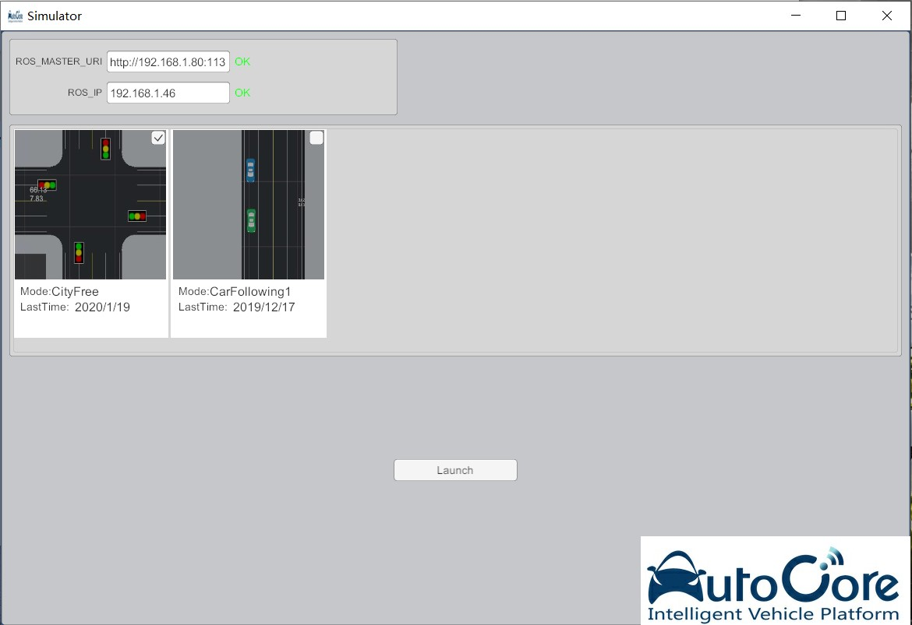
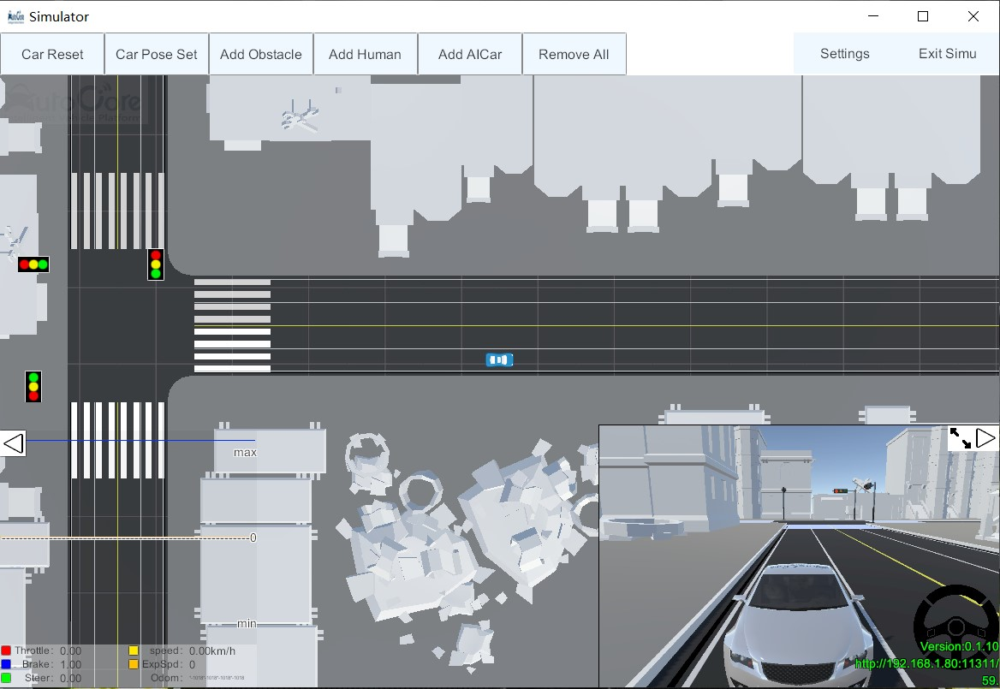

# Simulation

> AutoCore simulation tool virtualizes the real world driving scenarios based on Unity physical engine.  

## Table of Contents
1. [Overview](#overview)
2. [Requirement](#requirement)
   - [Simulator PC Requirement](#simulator-pc-requirement)
   - [Simulation Environment](#simulation-environment)
3. [Quick Start](#quick-start)
   - [Start PCU](#start-pcu)
   - [Start Simulator](#start-simulator)
   - [Start Autoware.AI](#start-autowareai)
   - [Simulation process](#simulation-process)
4. [Simulator Instruction](#simulator-instruction)
   - [Menu](#menu)
   - [Monitor](#monitor)
   - [Other operations](#other-operations)
   - [Log](#log)
5. [Interfaces](#interfaces)

## Overview

AutoCore simulation tool is developed based on Unity engine, which focuses kinematics principle of the vehicle and environment. It could simulate multi type of sensor inputs according to different driving cases and user configurable environmental conditions, so that the autonomous driving system could be tested and tuned in loop.

## Requirement

### Simulator PC Requirement

OS: Windows  
CPU：Intel i5 9100 or higher  
GPU：GTX 750Ti or higher  
Memory：>8G  
Free disk：>1GB  

### Simulation Environment

To use the simulator, you will need to build a simulation environment. 

In our case, we use two PCs and a PCU dev board. (As optional, )

- PCU dev board
  - Roscore
  - Localization
  - LiDAR perception
  - Traffic light detection (optional with TPU accelerator)
  - Control
- PC (windows)
  - Simulator
- PC (Ubuntu)
  - Global planner
  - Local planner
  - AutoCore IDE

## Quick Start

### Start PCU

After power on, PCU will automatically start runtime，and IDE tool is able to control the different functionalities. Roscore will start on PCU autonomously.

Use IDE to start the following nodes, the nodes which are not listed in below shall not be started (Some nodes may be configured as auto start, but without actual function）

- `sim_map_city`
- `voxel_filter` (Auto start)
- `pose_vel_connector` (Auto start)
- `ndt_matching`, make sure to enable `init_pos_gnss` (Auto start)
- `ray_ground_filter`, make sure to disable `output_ring`
- `cluster_euc`, choose `output_frame` as `velodyne`
- `feat_proj`

### Start Simulator

1. Download the simulator archive file, and extract it to a customized destination.  
   Download link: [Resource Download](Resource_download.md#simulation)

2. Double click `Simulator.exe` to run the simulator.  
   
  
3. Configure the ROSMaster IP and local IP, and choose the driving scenario, then click launch.  
    

4. If all the configuration is correct, you will see the main window of the simulator as below:  
    

Once simulator is started and PCU is on，you will be able to see correct NDT location in IDE and also the points cloud cluster output `/points_cluster`.

Simulator will send out `/ndt_pose`, `/estimate_twist` and the tf for map to base_link transform. 

### Start Autoware.AI

In our case we will use Autoware.AI running in docker environment to provide planning functionality.

* mkdir ~/shared_dir && cd ~/shared_dir
* Copy `pcu_exclude.launch` and `path.txt` to `shared_dir`folder
* wget -O run.sh https://gitlab.com/autowarefoundation/autoware.ai/docker/raw/master/generic/run.sh?inline=false
* sudo chmod +x run.sh
* . run.sh --ros-distro melodic --tag-prefix 1.13.0 --cuda off
* In docker: export ROS_IP= "host IP"
* roslaunch shared_dir/pcu_exclude.launch

### Simulation process

Now you could check whether all the topics are correctly sent from PCU, simulator and Autoware.AI. If no issues, we could begin the first drive.

1. Localization
   Reset the car location in the simulator, and check in localization result of PCU in IDE. If the localization result is not matching with the car location in the simulator, please manually set the location in IDE.

2. Set target
   Select a destination point in IDE, and wait for the global planner to calculate the route.

3. Start the vehicle
   After enable the DBW of the vehicle, you should see the car starts moving in both IDE and simulator.

## Simulator Instruction

### Menu

There are some buttons on the top of the main interfaces:

1. Car Reset  
   Click to reset the ego car location to the default starting point.

2. Car Pose Set  
   Click to pick a location for ego car, then move the mouse to set the oreintation.

3. Add Static Obstacle  
   Click to drop a obstacle at target place.

4. Add Human
   Click to add a pedestrian at the target place, multiple pedestrians could be added via multiple clicks. Right click to finish. 

5. Add CarAI
   Click to add a AI car at the target place, then click to add the destination for the AI car. AI car will run in the map according to the destination and follow traffic rules autonomously.

6. Remove All Obstacle
   Click to remove all obstacles.

7. Settings
   Click to open setting panel.

8. Exit Simu
   To exit simulator and go back to the launch panel.

### Monitor

The monitor shows the current ego vehicle information, and draws diagram with historic data. To hide the monitor,just click the button on the left top. 

### Other operations

- Left click to select target
- Right click to cancel
- Press the wheel and drag to move camera
- Move the wheel to zoom
- Press Ctrl and move the wheel to change the size of target
- Space: Reset camera
- "C": Switch camera in simulator
- "W": Move forward
- "S": Move backward
- "A": Left turn
- "D": Right turn
- "X": Brake

### Log

The log output is under `StreamingAssets/TestData` folder. The log file is named by time, with all the operations and accidents recorded.

## Interfaces

Publications:  
* /camera/camera_info [sensor_msgs/CameraInfo]  
* /estimate_twist [geometry_msgs/TwistStamped]  
* /gnss_pose [geometry_msgs/PoseStamped]  
* /image_raw [sensor_msgs/Image]  
* /ndt_pose [geometry_msgs/PoseStamped]  
* /points_raw [sensor_msgs/PointCloud2]  
* /tf [tf2_msgs/TFMessage]  
* /vehicle_status [autoware_msgs/VehicleStatus]  

Subscriptions:  
* /ide_cmd [unknown type]  
* /twist_cmd [geometry_msgs/TwistStamped]  

